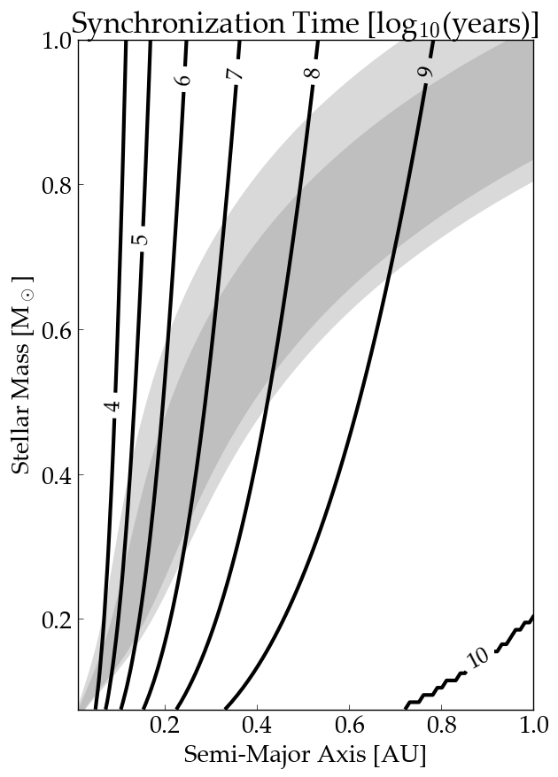

HZTideLock
==========

Timescale for a terrestrial exoplanet in the habitable zone (HZ) to tidally lock
according the the eqtide-CPL model from `VPLanet <https://github.com/VirtualPlanetaryLaboratory/vplanet>`_.

====================  ==========
**Date**              12/15/18
**Author**            Rory Barnes
**Modules**           EqTide
**Approx. runtime**   3 minutes
**Source code**       `VPLanet <https://github.com/VirtualPlanetaryLaboratory/vplanet>`_, `VPLot <https://github.com/VirtualPlanetaryLaboratory/vplot>`_
====================  ==========

This example calculates the timescale for a 1 Earth-mass, 1 Earth-radius terrestrial
exoplanet to tidally lock if it has a tidal Q of 12 and an eccentricity of 0.05. 
It requires `vplanet` and it supporting software packages `vspace` (part of `vplanet`)
and `vplot <https://github.com/VirtualPlanetaryLaboratory/vplot>`_. 

To run this code and generate a figure
-------------------

.. code-block:: bash

   vspace vspace.in
   python makeplot.py <pdf | png>

Expected output
---------------

